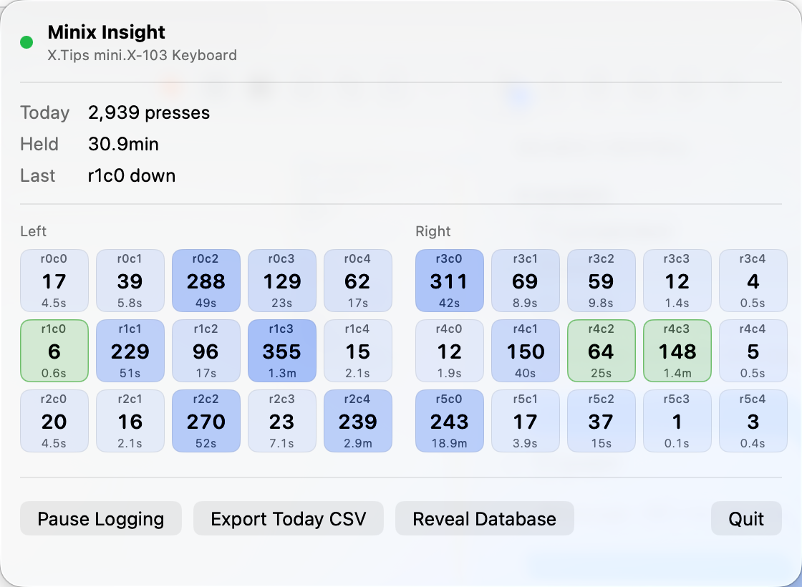

# Minix Insight

`Minix Insight` 是一款原生 macOS 菜单栏应用，用来采集 X.Tips miniX 键盘通过 QMK Raw HID 上报的物理按键事件，并将数据保存到本地 SQLite，便于后续做按键热力图、长按时长统计和人体工学分析。

它记录的是键盘矩阵层面的物理事件，不读取系统文本输入，也不依赖 macOS Accessibility 权限。

## 仓库关系

- 本仓库 `minix-insight` 负责 macOS 端采集、存储、导出和可视化。
- 固件侧配套仓库是 [xhugoliu/QMK-Keyboard](https://github.com/xhugoliu/QMK-Keyboard)，其中 miniX 的 QMK/Vial 固件负责通过 Raw HID 发送物理按键事件。
- 两边协议当前通过 `KS` 开头的 32 字节报文对接。

## 当前功能

- 菜单栏常驻状态图标
- 自动识别 `5262:4e4b` Raw HID 设备
- 物理按键事件写入本地 SQLite
- 菜单内显示今日统计
- `3x5 + 3x5` 正交分体键位统计视图
- 支持暂停/继续记录
- 支持导出当天 CSV

## 界面截图

当前菜单栏展开视图示例：



后续还可以继续补充键位热区、导出结果、历史统计等截图。

## 构建与运行

```bash
swift build
./scripts/package_app.sh
open dist/Minix\ Insight.app
```

打包后的应用默认将数据保存在：

```text
~/Library/Application Support/Minix Insight/minix-insight.sqlite3
```

记录期间请关闭 Vial 或 WebHID 页面，它们会占用同一个 Raw HID 接口。

## 固件协议

`Minix Insight` 目前默认接收 QMK 固件发出的 32 字节 Raw HID 报文：

| 字节范围 | 含义 |
| --- | --- |
| `0...1` | ASCII 魔数 `KS` |
| `2` | 协议版本，当前为 `1` |
| `3` | 事件类型，当前 `1` 表示按键事件 |
| `4` | 矩阵行 `row` |
| `5` | 矩阵列 `col` |
| `6` | 按下状态，`1` 为按下，`0` 为松开 |
| `7` | 当前层号 |
| `8...11` | QMK `timer_read32()` 毫秒计时，小端序 |
| `12...13` | QMK keycode，小端序 |
| `14...17` | 事件序号，小端序 |

Mac 端通过同一物理键位的 down/up 事件配对，计算累计按下次数和按住时长。

## 说明

- 本应用不监听系统级键盘输入，只读取键盘暴露的 vendor-defined Raw HID 接口。
- 如果后续协议字段扩展，macOS 端与 QMK 固件端需要同步更新。
